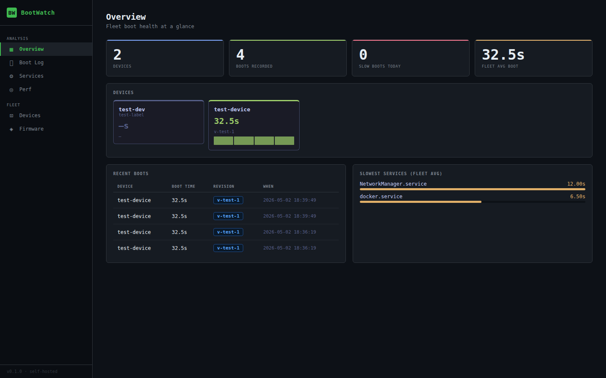
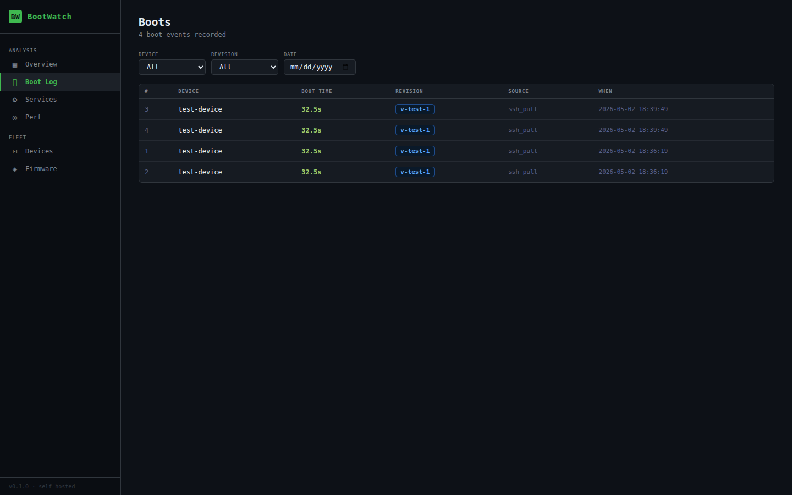
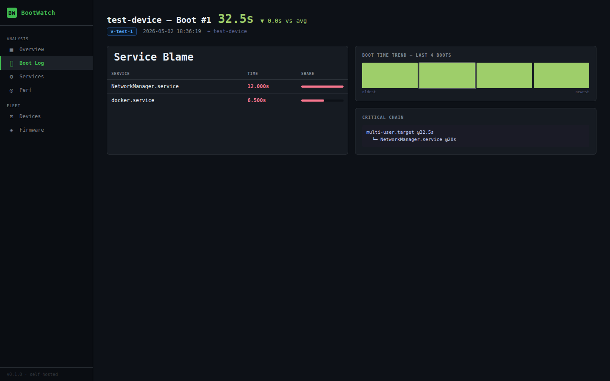
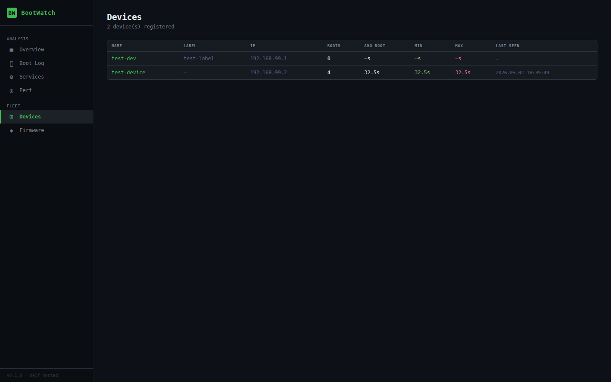
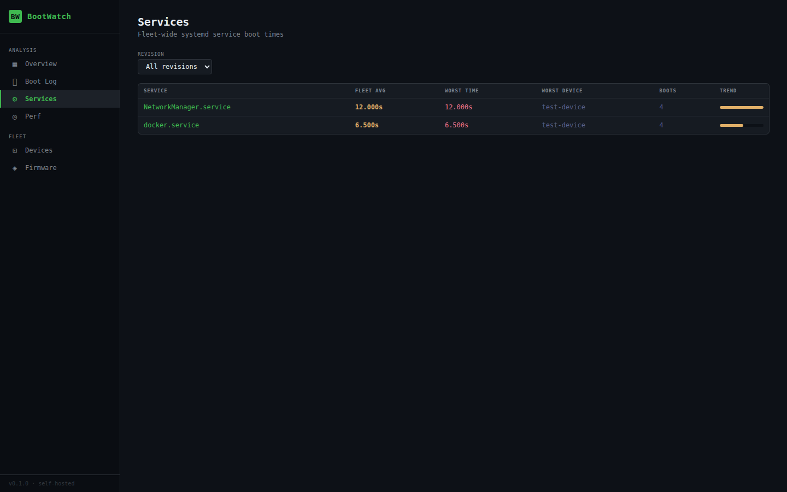
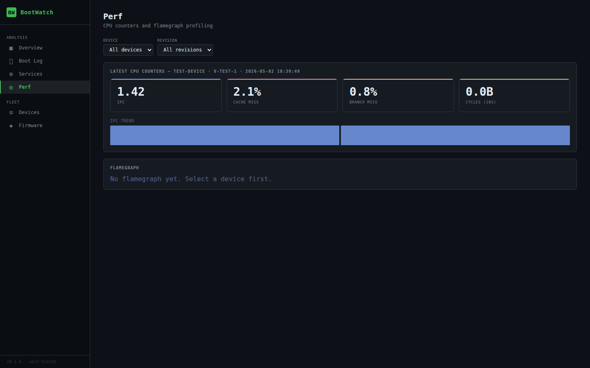

# BootWatch

Self-hosted boot analysis dashboard for embedded Linux device fleets. Ingests `systemd-analyze` blame, critical chain timings, and `perf` hardware counters — visualised per device, per firmware revision, and across the whole fleet.

---

## Screenshots

**Overview** — fleet health at a glance


**Boot Log** — paginated, filterable boot history


**Boot Detail** — blame table, trend chart, critical chain


**Devices**


**Services** — fleet-wide worst offenders


**Perf** — CPU counters + flamegraph


---

## Features

| Area | What you get |
| ------ | ------------- |
| **Boot timing** | Total boot time per boot, color-coded by threshold (green/amber/red vs fleet average) |
| **Blame table** | Per-service startup time breakdown from `systemd-analyze blame`, sortable |
| **Critical chain** | Full `systemd-analyze critical-chain` output stored per boot |
| **Boot trend chart** | Last 10 boot times plotted as inline bar chart on the boot detail page |
| **Fleet overview** | Sparklines + slowest services + recent boots on a single dashboard |
| **Firmware comparison** | Side-by-side avg/min/max boot times per firmware revision |
| **Service drill-down** | Fleet-wide worst offenders with click-through to affected boots |
| **Perf counters** | IPC, cache-miss %, branch-miss % from `perf stat` per boot |
| **Flamegraph** | On-demand `perf record` → SVG flamegraph generated via SSH, rendered inline |
| **Multi-device** | Parallel SSH collector for fleets; devices identified by IP + hostname |

---

## Pages

| Page | URL | Description |
| ------ | ----- | ------------- |
| Overview | `/` | Fleet health at a glance — device grid with sparklines, recent boots, slowest services |
| Boot Log | `/boots` | Paginated boot list, filterable by device / revision / date / service |
| Boot detail | `/boot/<id>` | Blame table, trend chart, critical chain output |
| Services | `/services` | Fleet-wide service timing, click-through to affected boots |
| Perf | `/perf` | CPU counters + IPC trend chart + on-demand flamegraph |
| Devices | `/devices` | All devices with avg / min / max boot stats |
| Device detail | `/device/<id>` | Per-device boot history and stats |
| Firmware | `/firmware` | Per-revision boot time comparison table |

---

## Quick Start (local)

```bash
git clone https://github.com/sberaconnects/bootwatch.git
cd bootwatch
cp .env.example .env
# Edit .env — set DB_ROOT_PASSWORD, DB_PASSWORD, SECRET_KEY to strong random values
docker compose -f docker-compose.yml -f docker-compose-local.yml up -d
# UI at http://localhost:8080
```

Then push your first boot record:

```bash
pip install paramiko
python3 tools/collect.py --device 192.168.1.100 --name my-device --server 127.0.0.1 --port 8080
```

---

## Architecture

```text
┌─────────────────────────────────────────────────────┐
│  Docker Compose                                      │
│                                                      │
│  ┌──────────────┐     ┌─────────────────────────┐   │
│  │  flask-web   │────▶│       MariaDB            │   │
│  │  (Flask 3)   │     │  6 tables, utf8mb4       │   │
│  └──────┬───────┘     └─────────────────────────┘   │
│         │ /api/boot POST                             │
└─────────┼───────────────────────────────────────────┘
          │
    ┌─────┴──────────────────────────┐
    │  Data collection               │
    │                                │
    │  tools/collect.py              │  SSH pull (on demand)
    │  tools/collect-all.py          │  Parallel multi-device
    │  tools/install-hook.py         │  Installs boot systemd unit
    └────────────────────────────────┘
```

**Flask** serves all pages server-side with Jinja2 templates. No JavaScript framework — charts are inline CSS bars. **MariaDB** stores 6 tables: devices, revisions, boots, blame entries, perf stats, flamegraphs.

---

## Data Collection

### SSH pull (on demand / cron)

```bash
# Single device
python3 tools/collect.py \
  --device 192.168.1.100 \
  --name   my-board \
  --server 127.0.0.1 \
  --port   8080

# Whole fleet in parallel
cp tools/devices.txt.example tools/devices.txt
# devices.txt: one line per device — <ip> <name> [label]
python3 tools/collect-all.py \
  --devices-file tools/devices.txt \
  --server 127.0.0.1 \
  --threads 8
```

`collect.py` options:

| Flag | Default | Description |
| ------ | ------- | ------------- |
| `--device` | required | Device IP |
| `--server` | `127.0.0.1` | BootWatch server IP |
| `--port` | `8080` | BootWatch server port |
| `--ssh-user` | `root` | SSH username |
| `--ssh-port` | `22` | SSH port |
| `--ssh-key` | — | Path to private key file |
| `--name` | `device` | Device display name |
| `--label` | — | Optional free-text label |
| `--version` | auto | SW revision (reads `/etc/os-release` if omitted) |
| `--skip-perf` | false | Skip `perf stat` collection |
| `--perf-duration` | `10` | Seconds for `perf stat` window |

### Boot hook (automatic on every boot)

Installs a systemd one-shot unit that runs `bootwatch-report.sh` after `network-online.target`:

```bash
python3 tools/install-hook.py \
  --device  192.168.1.100 \
  --server  10.0.0.5 \
  --port    8080 \
  --ssh-key ~/.ssh/id_ed25519
```

`install-hook.py` options:

| Flag | Default | Description |
| ------ | ------- | ------------- |
| `--device` | required | Device IP |
| `--server` | `127.0.0.1` | BootWatch server (reachable from device) |
| `--port` | `8080` | BootWatch port |
| `--ssh-user` | `root` | SSH username |
| `--ssh-key` | — | SSH private key |
| `--version-key` | `VERSION_ID` | Key in `/etc/os-release` used as revision |

---

## Environment Variables

Copy `.env.example` to `.env` and set every value before starting:

| Variable | Description |
| ---------- | ------------- |
| `DB_ROOT_PASSWORD` | MariaDB root password |
| `DB_PASSWORD` | MariaDB `bootwatch` user password |
| `DB_NAME` | Database name (default: `bootwatch`) |
| `DB_USER` | DB username (default: `bootwatch`) |
| `SECRET_KEY` | Flask session secret — use `openssl rand -hex 32` |
| `DOMAIN` | Production only — your public hostname |
| `ACME_EMAIL` | Production only — Let's Encrypt contact email |

---

## Production Deployment (Traefik + TLS)

```bash
# Edit .env first: DOMAIN=bootwatch.example.com, ACME_EMAIL=you@example.com
docker compose -f docker-compose.yml -f docker-compose-production.yml up -d
```

Traefik handles ACME/Let's Encrypt certificate provisioning and HTTP→HTTPS redirect automatically. Port 80 and 443 must be reachable from the internet.

---

## Database Schema

Six InnoDB tables with `utf8mb4_unicode_ci` collation:

```text
bw_devices        — ip_addr (UNIQUE), name, label
bw_sw_revisions   — revision string (UNIQUE)
bw_boots          — boot_time_s, critical_chain, source, FK→device+revision
bw_blame_entries  — service, time_s, FK→boot (CASCADE DELETE)
bw_perf_stats     — IPC, cache/branch counters, FK→boot+device+revision
bw_flamegraphs    — status ENUM, svg_path, FK→device+revision
```

Key indexes: `(device_id, collected_at)` on boots; `(device_id, revision_id, collected_at)` on perf_stats; `(device_id, status)` on flamegraphs.

---

## API

Single ingest endpoint — used by both `collect.py` and the boot hook:

```json
POST /api/boot
Content-Type: application/json

{
  "device_ip":    "192.168.1.100",
  "device_name":  "my-board",
  "device_label": "lab-bench",
  "revision":     "3.1.4",
  "source":       "ssh_pull",
  "boot_time_s":  14.7,
  "blame": [
    {"service": "NetworkManager.service", "time_s": 4.2},
    ...
  ],
  "critical_chain": "...",
  "perf_stat": {           // optional
    "duration_s": 10,
    "ipc": 1.43,
    "cache_miss_pct": 2.1,
    "branch_miss_pct": 0.8,
    ...
  }
}

→ 201 {"boot_id": 42}
```

Flamegraph endpoints:

```text
POST /api/flamegraph/<device_id>          — trigger perf record via SSH
GET  /api/flamegraph/<device_id>/status   — poll: {status, svg_url}
```

---

## Running Tests

Requires running MariaDB (local compose or bare metal):

```bash
# Start MariaDB only
docker compose -f docker-compose.yml -f docker-compose-local.yml up -d mariadb

# Install test deps
pip install flask pymysql cryptography pytest

# Run suite (13 tests)
cd web && TEST_DB_HOST=127.0.0.1 python3 -m pytest ../tests/ -v
```

Tests cover: API ingest (201/400/no-perf), DB idempotency (get-or-create), all 8 page routes (200/404).

---

## Development

```bash
# Work directly in the worktree
cd .worktrees/bootwatch-impl

# Flask hot-reload (with DB running)
cd web
FLASK_DEBUG=1 DB_HOST=127.0.0.1 DB_USER=bootwatch DB_PASSWORD=... \
  DB_NAME=bootwatch SECRET_KEY=dev python3 -m flask --app app run --port 5001
```

Templates are in `web/templates/`. All styling is in `base.html` — single CSS block, no external dependencies, no build step.

---

## License

MIT
